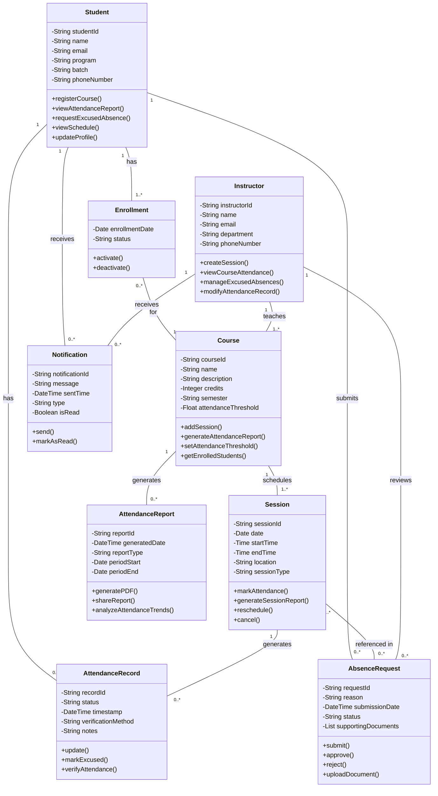

## Key Design Decisions
- **Enrollment**: to manage the many-to-many relationship between Students and Courses.
- **Notification**: to handle system communications.

---

## Relationship Design

- **Many-to-many** relationship between Student and Course implemented using an `Enrollment` class.
- **One-to-many** relationship between Course and Session (a course has multiple sessions).
- **One-to-many** relationship between Student/Session and AttendanceRecord (each student has a record for each session).
- **One-to-many** relationship between Instructor and Course (an instructor teaches multiple courses).

---

## Attribute and Method Definition

- Each entity has a unique identifier and domain-specific attributes.
- Methods focus on the core responsibilities of each entity.
- Status fields are included to track the state of records and requests.

---

## Verification and Approval Workflow

- The `AbsenceRequest` class handles the workflow for excused absences.
- `AttendanceRecord` includes verification method and timestamp for audit purposes.
- The `Notification` system supports the communication of important events.

---

## Reporting Capabilities

- The `AttendanceReport` entity is dedicated to generating and managing reports.
- Methods are included for the analysis and sharing of attendance data.
